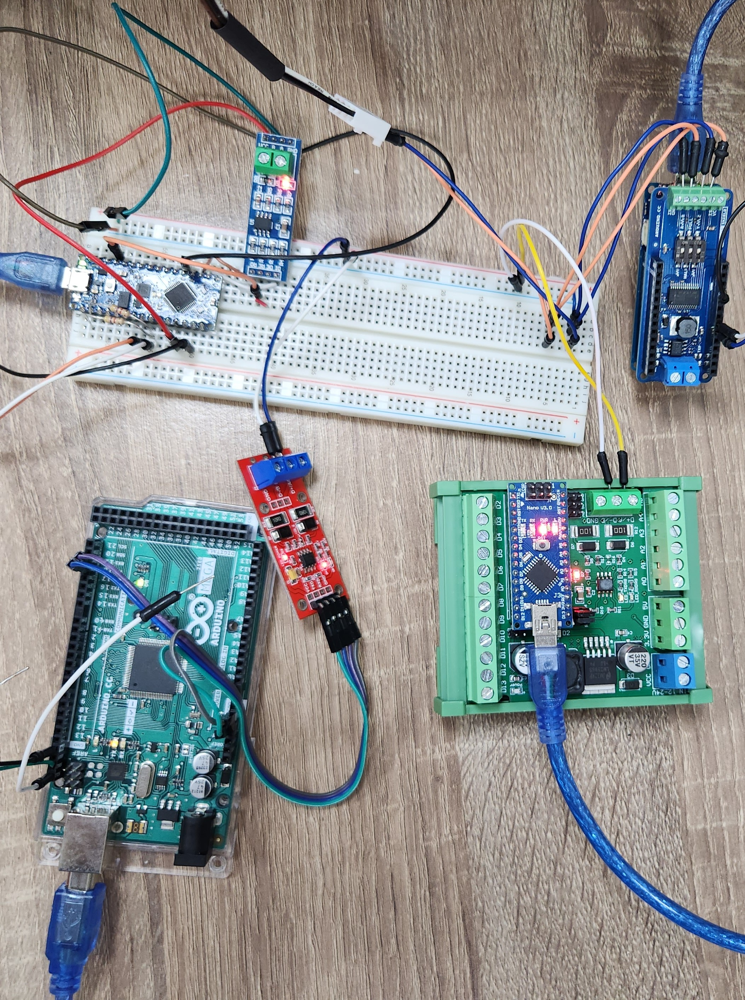
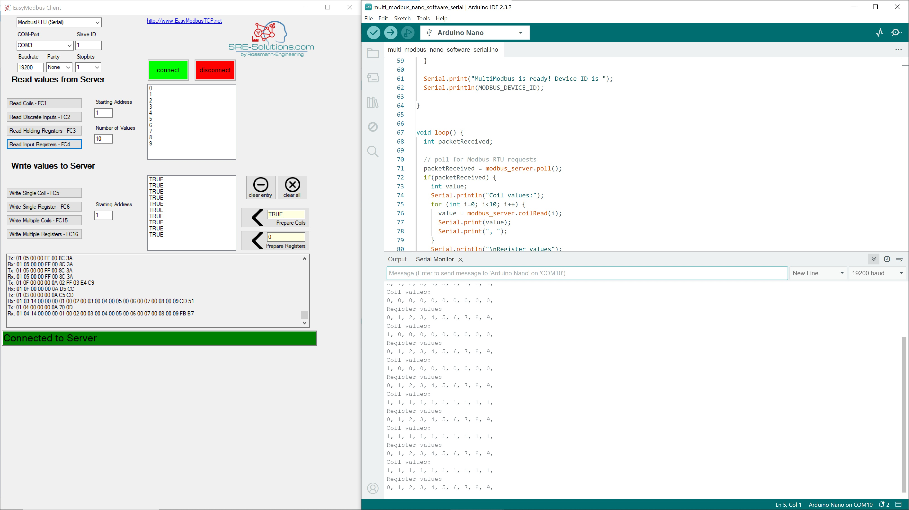

# MultiModbus

MultiModbus is an Arduino library that supports multiple Modbus RTU servers and clients over RS485 on one board. RS485-to-UART ICs are required.

## Introduction

MultiModbus supports multiple Modbus servers/clients on one board. Modbus messages are exchanged over RS-485 wires, requiring a MAX485 IC for each channel to convert the RS485 signal to a UART. We leverage [ArduinoModbus](https://github.com/arduino-libraries/ArduinoModbus) RTU class and [Robert Tillaart's RS485](https://github.com/RobTillaart/RS485). The original ArduinoModbus is based on ArduinoRS485 and [libmodbus](https://libmodbus.org/), and fixed to use hardware Serial1. We replace the ArduinoRS485 with Rob's RS485 and enable using different hardware/software serial ports. We have successfully run our library on MEGA, UNO, and NANO using SoftwareSerial. However, keep in mind that SoftwareSerial library may conflict with other comminucation libraries such as Wire, so our library is best run on a board with multiple hardware serial ports.

## Example

We provide a [Modbus server example](sketch/sketch_multi_modbus_server/sketch_multi_modbus_server.ino). You can use the [EasyModbus](https://github.com/rossmann-engineering/EasyModbusTCP.NET) to communicate with the server. The code has been tested on various boards including Arduino NANO, MEGA, and UNO. The maximum number of servers/clients depends on the target boards.

